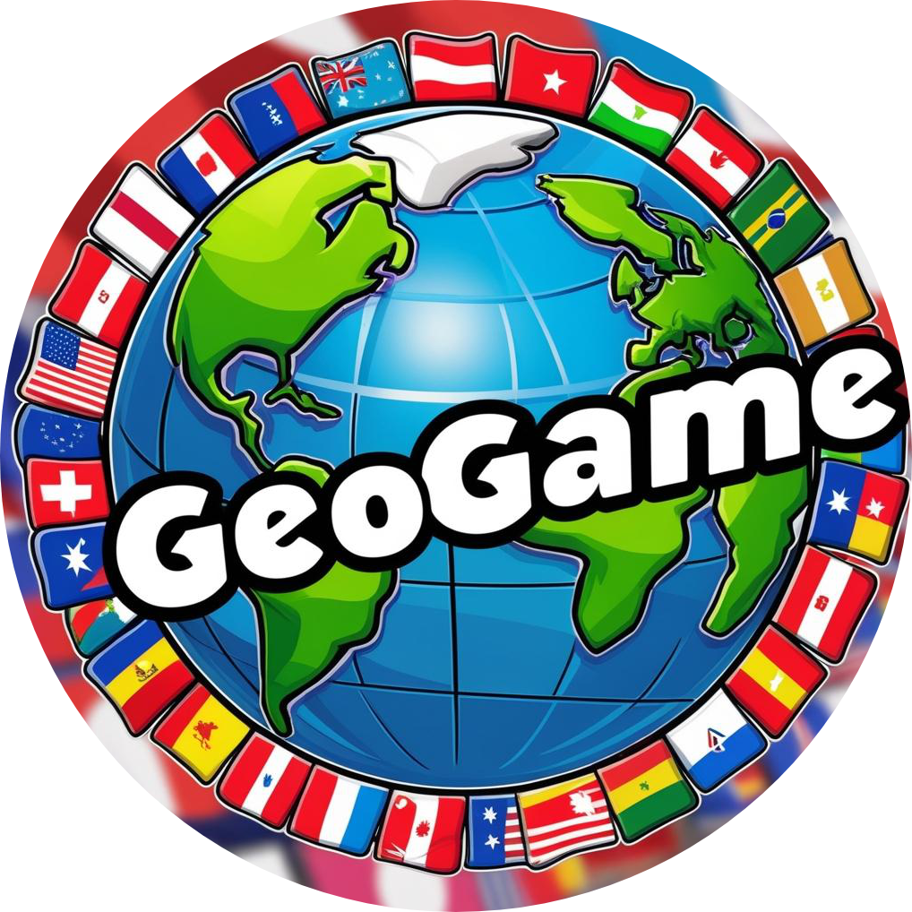
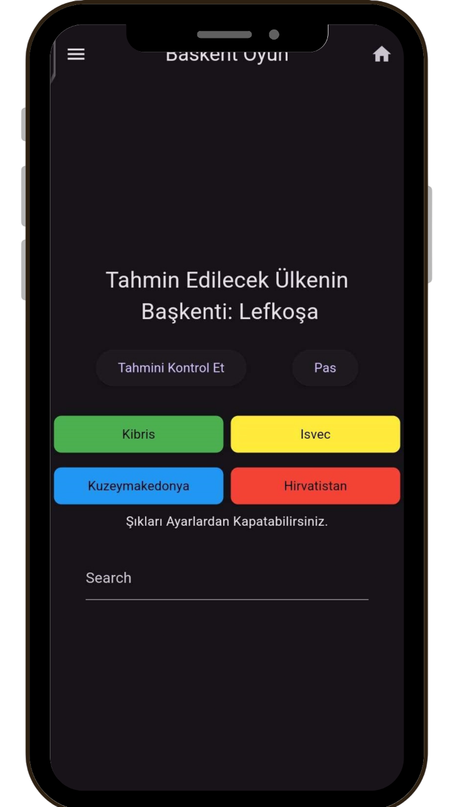
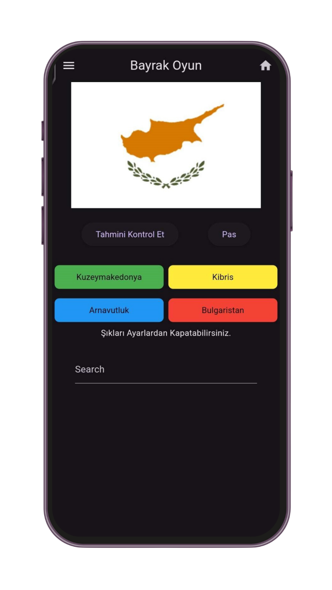
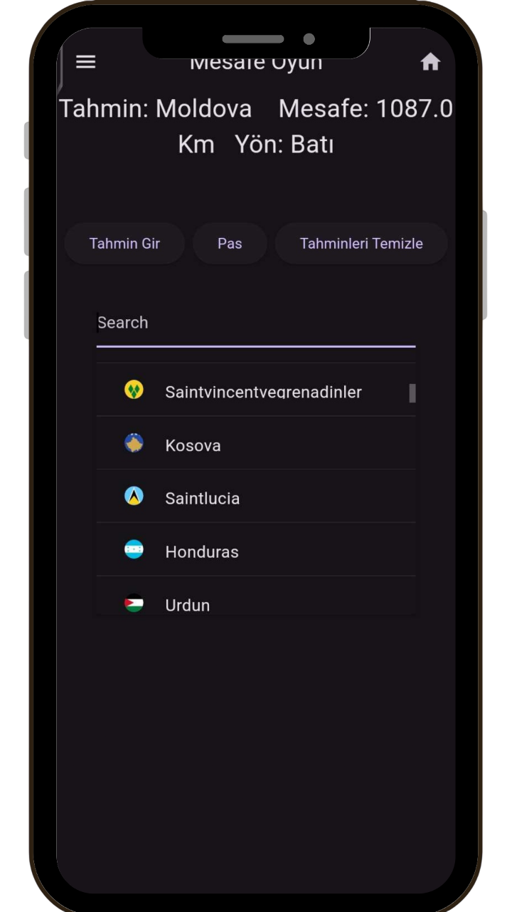
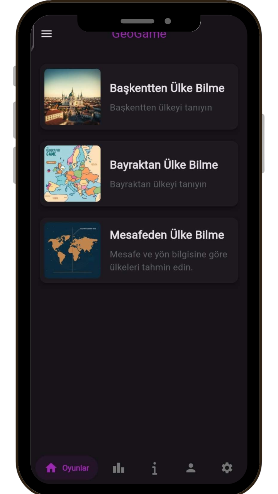
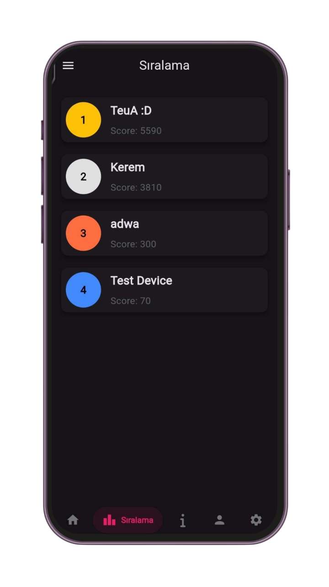
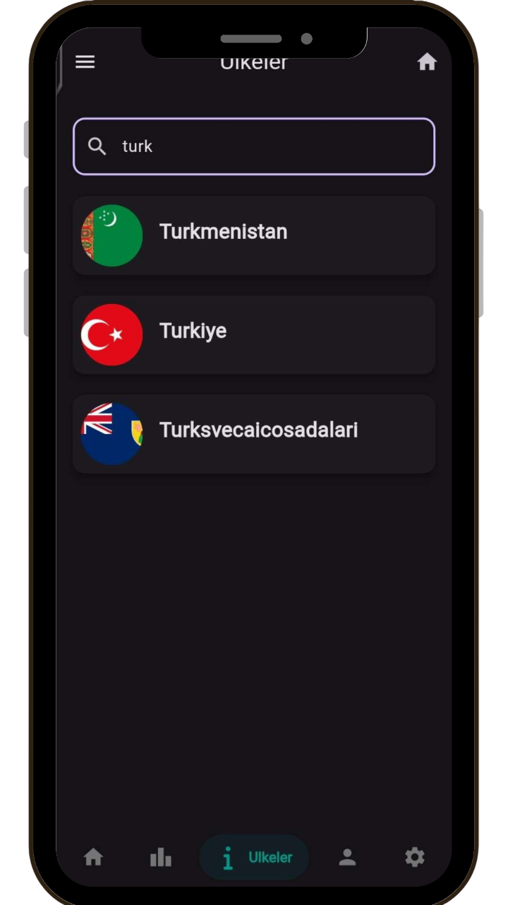
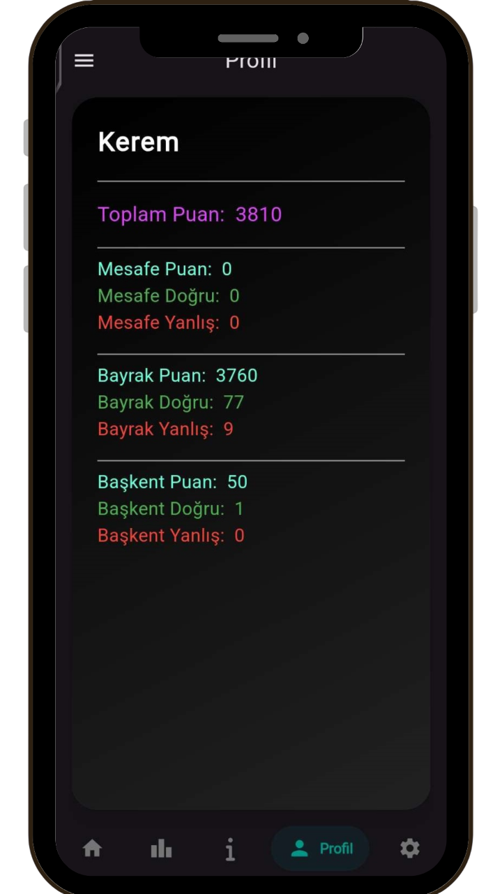
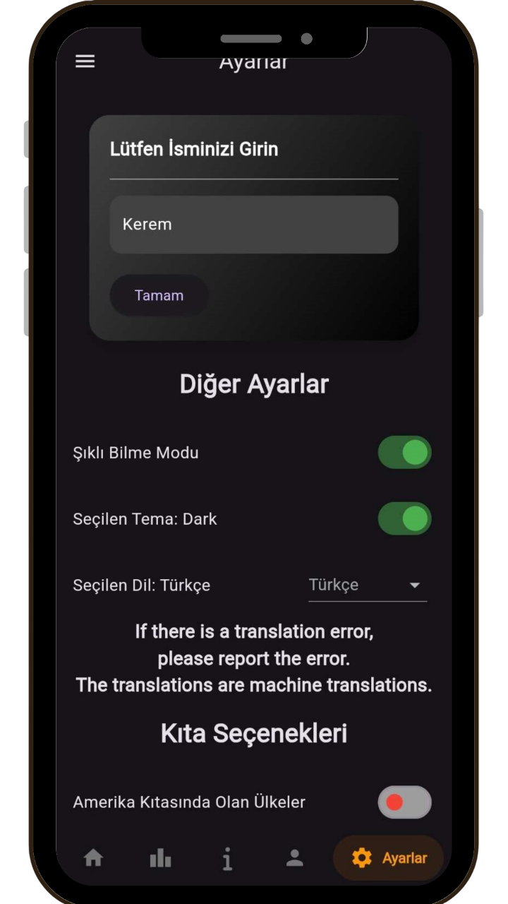

# 🌍 GeoGame

  <a href="TR.md">🇹🇷 Türkçe</a>

  

  
  

---

**GeoGame** is an educational game designed to enhance your geographical knowledge through interactive quizzes and challenges.

🎮 **Play with capital cities, flags, distance estimation, and more!**  
📱 Available on **Mobile** and **Windows**  
🌐 Supports **Turkish** 🇹🇷 and **English** 🇬🇧  

---

## 🌐 Website

Play the game or explore updates on the official website:  
➡️ [**GeoGame Website**](https://geogame.keremkk.com.tr)

---

## 📦 Download

Download the latest release and play GeoGame:  
➡️ [**GeoGame - Latest Release**](https://github.com/keremkuyucu/GeoGame/releases/latest)

---

## 🧠 Features

- ✅ Quiz on countries’ capitals, flags, and distances  
- ✅ Continent-focused levels: Europe, Asia, Africa & more  
- ✅ Real-time leaderboard powered by Discord  
- ✅ Simple and intuitive UI (Material Design)  
- ✅ Cross-platform: works on **mobile devices** and **desktop (Windows)**  
- ✅ Cloud login system via Google Sign-In  

---

## 🖼️ Screenshots

  
  
  
  
  
  
  
  

---

## 🧰 Tech Stack

| Layer        | Tech Used                             |
|--------------|----------------------------------------|
| **Frontend** | Flutter, Dart                          |
| **Backend**  | Next.js (hosted on Vercel)             |
| **Auth**     | Google Sign-In via Firebase & Web App  |
| **Database** | Discord Webhooks (for leaderboard)     |
| **Web**      | Next.js                                |

---

## 🧩 Project Structure

GeoGame consists of multiple open-source repositories that work together as a full system:

| Repository | Description |
|------------|-------------|
| [**GeoGame**](https://github.com/keremkuyucu/GeoGame) | Main Flutter app for mobile and PC |
| [**geogame-api**](https://github.com/keremkuyucu/geogame-api) | REST API for score handling, user data, leaderboard updates |
| [**geogame-auth-web**](https://github.com/keremkuyucu/geogame-auth-web) | Google Sign-In authentication and redirect handling |
| [**geogame-cdn**](https://github.com/keremkuyucu/geogame-cdn) | CDN for JSON data, country info and assets |
| [**geogame-website**](https://github.com/keremkuyucu/geogame-website) | Official website and landing page |
| [**GeoGameCPP**](https://github.com/keremkuyucu/GeoGameCPP) | The original version of GeoGame developed in C++ |

---

## 🖥️ Backend Functionality

- 📡 **Real-time leaderboard updates** using Discord Webhooks  
- 🔁 **GitHub JSON as data source** for country info and quiz questions  
- 🧠 **Server-side logic** for verifying scores and managing user profiles  
- 🔐 **OAuth-based login system** using Firebase & Web Gateway

---

## 📜 License

This project is licensed under the **GNU General Public License v3.0**.  
See the [**LICENSE**](LICENSE) file for full details.

---

## 🙋‍♂️ Author

Developed with ❤️ by [Kerem Kuyucu](https://github.com/keremkuyucu)  
> Student and Developer
> 📍 Bilecik, Türkiye

---

