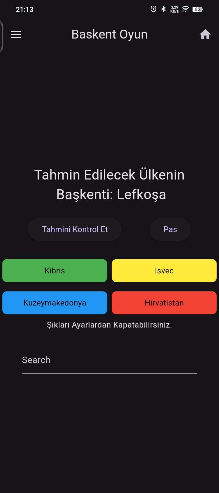
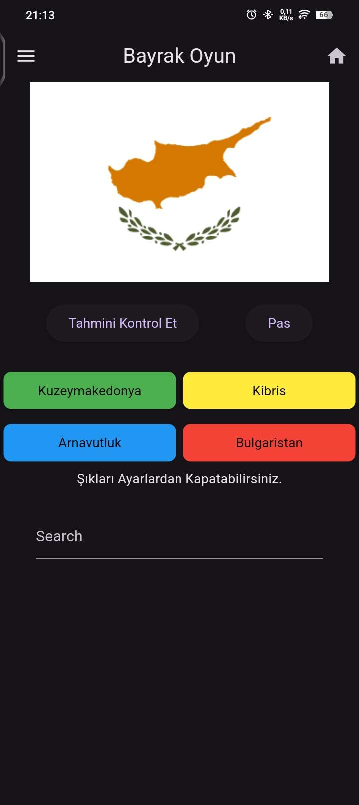
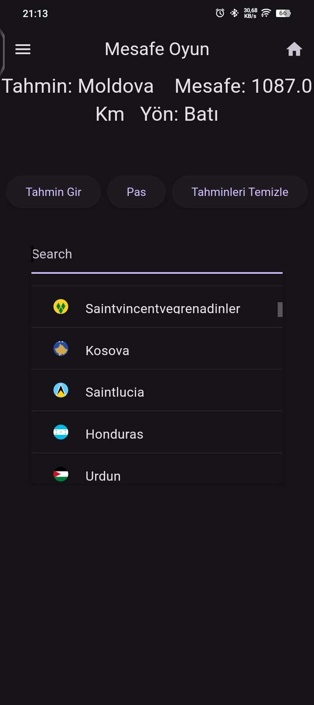
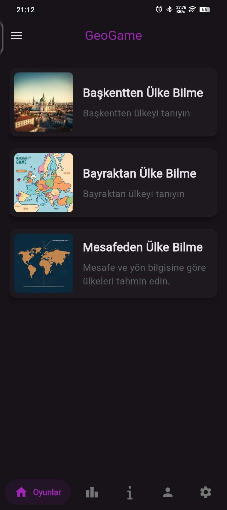
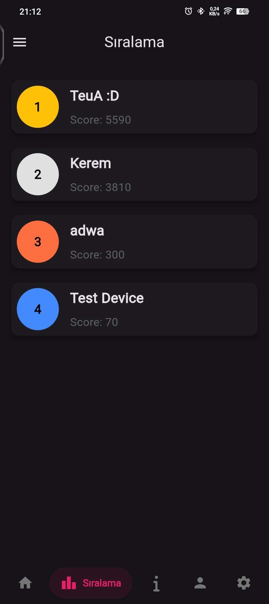
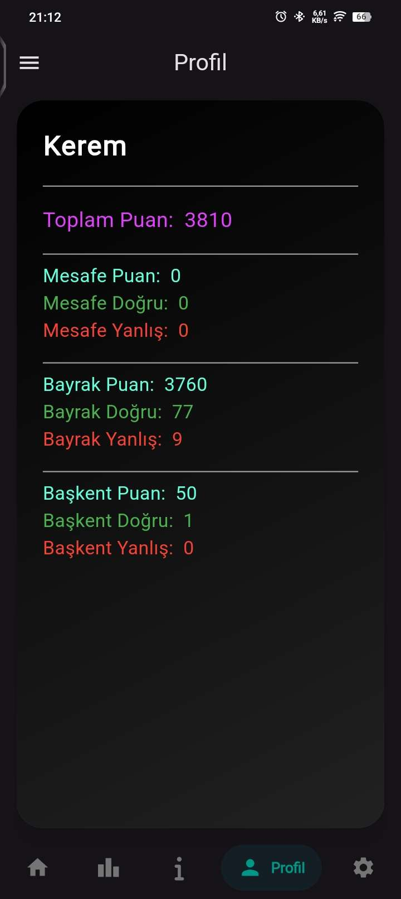
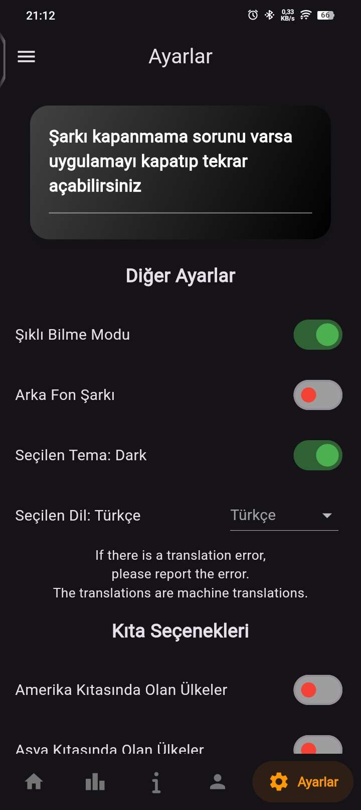

# GeoGame

GeoGame, ülkeler hakkında bilginizi geliştirmek için oynayabileceğiniz eğitici bir oyun. Başkentler, bayraklar ve diğer coğrafi bilgilerle kendinizi test edin ve dünya hakkında daha fazla şey öğrenin!

# Api

Geogame leadboard için discord apilerini kullanır.
Sunucu kodları için [Tıkla](https://github.com/keremlolgg/geogame-api)

# Demo

Projeyi deneyimlemek için aşağıdaki linkten oyuna erişebilirsiniz:

[GeoGame](https://github.com/keremlolgg/GeoGame/releases/latest)

# Desteklenen Diller

Türkçe, English, Español, Deutsch, Русский, 中文, Kurdî, Français, Português, العربية

# Özellikler

Ülkelerin başkentleri, bayrakları ve diğer coğrafi bilgileriyle ilgili sorular

Avrupa, Asya, Afrika ve diğer kıtalar hakkında bilgi edinme

Kullanıcı dostu arayüz ve eğlenceli bir deneyim

Mobil ve Windows uyumlu

# Ekran Görüntüleri

Aşağıda oyuna ait ekran görüntülerini bulabilirsiniz:

  
  
  
  
  
  
  
  

# Kullanılan Teknolojiler

Flutter: Mobil ve web uygulama geliştirme çerçevesi

Dart: Uygulamanın yazıldığı programlama dili

Glitch: Web uygulaması barındırma platformu

Discord: Sıralama verilerinin saklandığı ve işlendiği yer

# Backend tarafı

Uygulama githubdan çektiği anlık api linki ile discordda puan durumunu gönderir arka tarafda serverde çalışan uygulama puanı alır tabloya ekler ve discordda yükler ve gerektiğinde çekmesi için webhook mesajını düzenler

# Lisans

Bu proje GPL Lisansı ile lisanslanmıştır. Daha fazla bilgi için [LİSANS](LICENSE) dosyasına göz atabilirsiniz.

